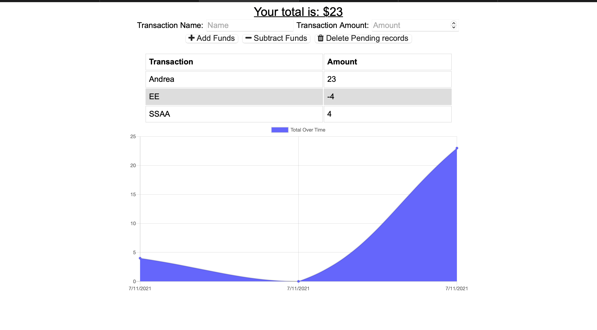

# Progressive-Budget

 

    
       
    
    
    
    
      
      
      

## Description

Track your finance with this Progressive Budget. The app will keep track of your expenses and income. The app dashboard will display a graphs of your wallet.

## Table of Contents

* [Installation](#installation)
* [Usage](#usage)
* [Screenshots](#screenshots)   
* [Credits](#credits)
* [License](#license)

## Installation

1. Clone repository. 
2. npm install
3. node server.js

Running seeders/seed.js is optional to have a prepopulated database.

    

## Usage

### Screeshots

1. Homepage 

## Credits

### Author

- 💼 Lloret82: [portfolio](https://lloret82.github.io/Professional_Portfolio/)
- Github: [Lloret82](https://www.github.com/lloret82)

### Built With

 

    
    
    
    
    
    
    

## License

 

